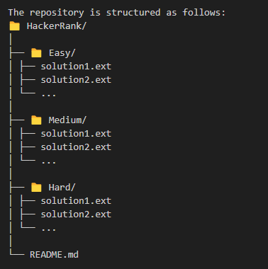

# HackerRank Algorithm Solutions

Welcome to my HackerRank Algorithm Solutions repository! This repo contains solutions to various algorithm challenges from HackerRank. The solutions are written in **[C# and Javscript]** and are organized by difficulty and problem type.

## Table of Contents

- [Introduction](#introduction)
- [Folder Structure](#folder-structure)
- [How to Use](#how-to-use)
- [Contributing](#contributing)
- [License](#license)
- [Contact](#contact)

## Introduction

This repository contains my solutions to algorithm problems on HackerRank. The solutions aim to be efficient, well-documented, and easy to understand. The challenges vary in difficulty, from easy to hard, and cover a range of topics like sorting, searching, dynamic programming, and more.

## Folder Structure

- **Easy/**: Contains solutions to easy-level problems.
- **Medium/**: Contains solutions to medium-level problems.
- **Hard/**: Contains solutions to hard-level problems.

Each folder contains files named according to the problem they solve. The `.ext` denotes the file extension of your programming language (e.g., `.py`, `.cpp`, `.java`, etc.).

## License

This project is licensed under the MIT License - see the [LICENSE](LICENSE) file for details.

## Contact

If you have any questions or suggestions, feel free to reach out:

- **Email**: [troyphan98@gmail.com](mailto:your-email@example.com)
- **GitHub**: [phanvuminhtrung](https://github.com/phanvuminhtrung)

